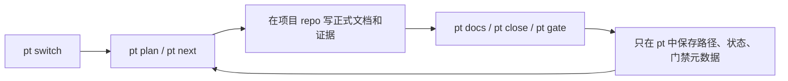
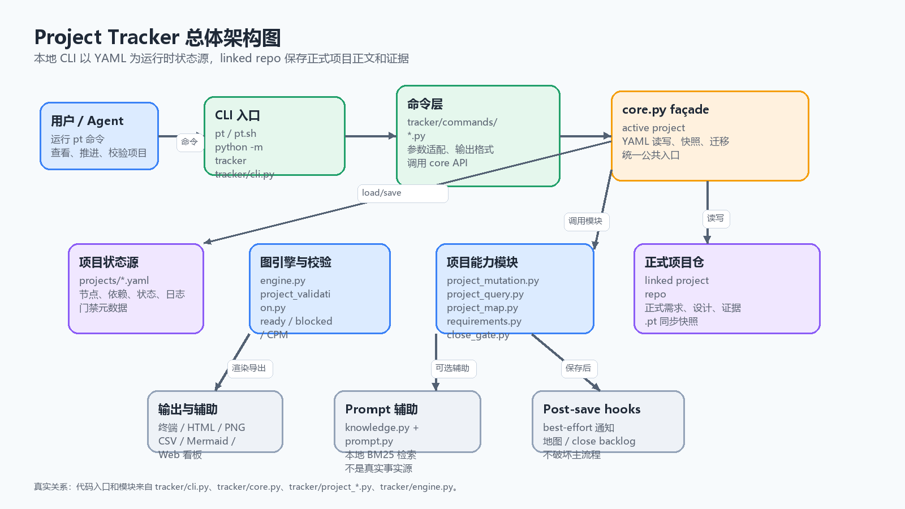
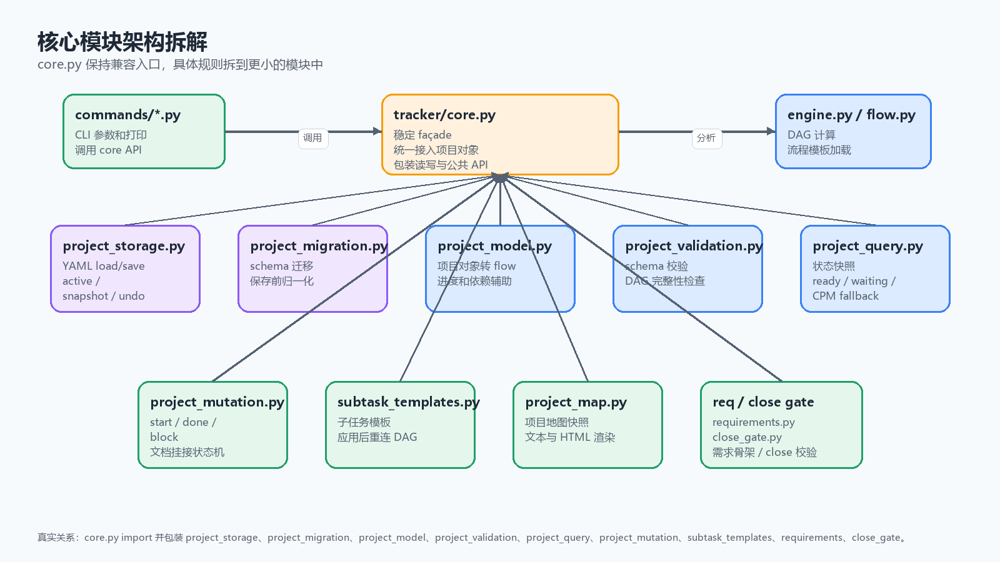
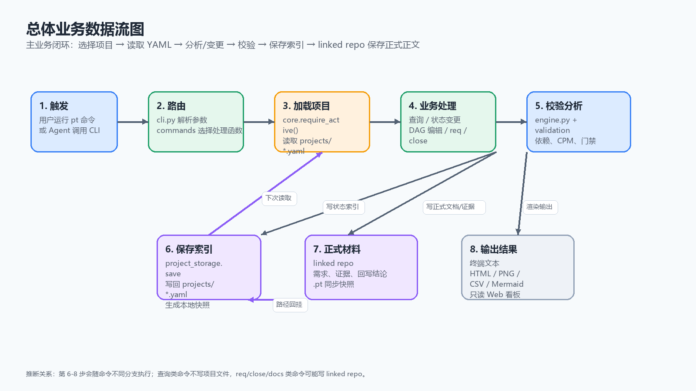
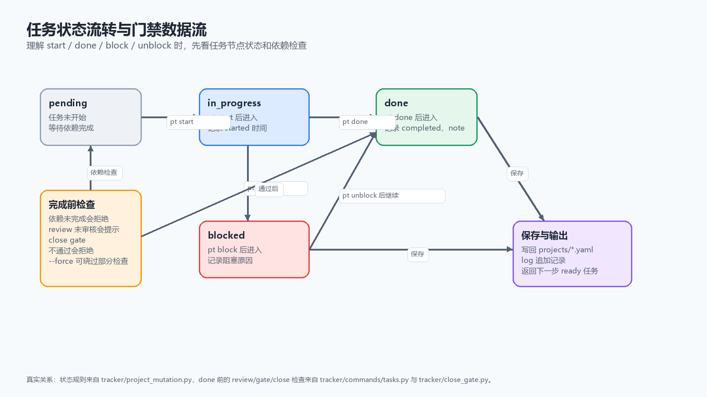
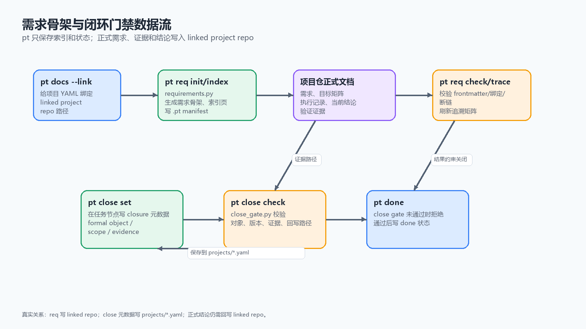
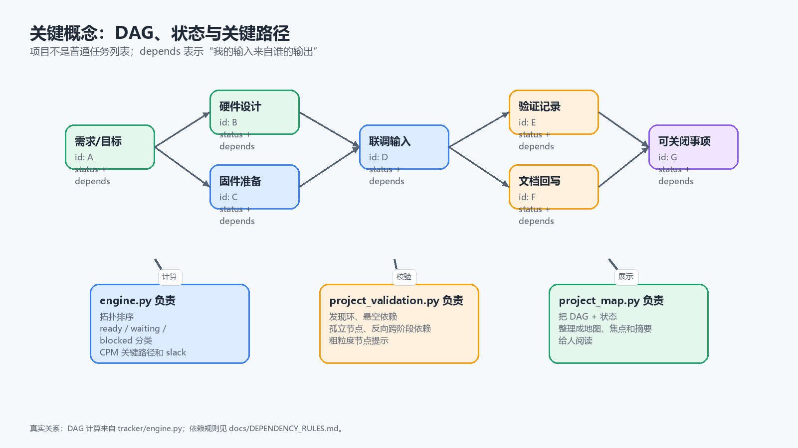

# Project Tracker (项目推进助手)

`project-tracker` 是一个轻量项目推进辅助工具。它帮助你用 `pt` 查看项目状态、下一步行动、任务依赖、文档挂接和简单闭环门禁；它不是项目正文归档仓、复杂项目管理平台或知识库系统。

正式需求、设计说明、BOM、测试记录、样品记录、发布结论和长期知识，应放在各自项目 repo、wiki 或专用知识库中。`project-tracker` 只保存紧凑状态、索引、路径和门禁元数据。

路线约束见 [Issue #1](https://github.com/joyhpc/project-tracker/issues/1)：当前阶段保持轻量辅助，暂缓深度项目管理化。


## 核心能力

- 项目 YAML 状态索引：阶段、任务、依赖、负责人、状态和日志
- DAG + CPM：计算关键路径、slack、可并行任务和下一步行动
- 文档路径挂接：把任务指向 linked project repo 中的正式文件
- 决策 / PoC / review 简要索引：只记录标题、状态、路径和少量摘要
- 简单门禁：提醒证据、样品、版本、正式回写路径是否缺失
- 导出与可视化：终端项目地图、Mermaid 依赖图、Gantt、CSV

以下能力如果仍存在于代码中，应视为待核验或实验能力，不应继续扩张：深度 prompt 生成、内置知识检索、复杂自动同步、跨仓自动 ingest、Web/通知集成。

## Agent 工作边界

AI / Agent 可以协助阅读代码、修改 `pt` 工具实现、补充测试、更新工具文档，并运行真实命令完成验证，例如 `pytest -q`、`python -m tracker validate --all`、`python tools/check_repo_boundary.py` 或具体 CLI 试跑。

Agent 的工作范围必须服从本仓库的轻量定位：

- 可以改进 `tracker/`、`tests/`、`docs/`、`flows/` 和项目索引相关逻辑，但新能力应服务“状态索引、显式命令、校验提醒”。
- 可以维护 `projects/*.yaml` 中的紧凑状态、路径、依赖和门禁元数据；不得把正式需求、设计、验证记录、BOM、样机记录或发布结论长期写入本仓。
- 需要生成模板、证据表、报告或回写页时，优先写到 linked project repo；若必须在本仓产生临时输出，应放入 ignored 输出目录。
- `doctor`、健康检查、边界检查和 closure check 类命令必须只读，只能解析、汇总、报告，不得迁移、修复、生成报告或写回项目文件。
- 自然语言入口必须保持“解析预览”和“写入执行”分离；`--dry-run` 不得写入，`--json` 只表示输出格式。
- 涉及定稿、发板、闭环、回写等硬件阶段跨越时，必须先检查证据锚点、正式对象、适用范围和关闭方式，不得用口头结论替代项目 repo 中的正式回写。

## 安装

```bash
git clone git@github.com:joyhpc/project-tracker.git
cd project-tracker
python -m venv .venv
. .venv/bin/activate
pip install -e .
```

Windows 上可直接使用：

```powershell
python -m tracker --help
```

## 快速开始

```bash
# 创建和切换项目
pt init CASE1 --name "Case 1" --flow generic --repo ../CASE1-docs
pt switch CASE1

# 轻量推进
pt status
pt plan
pt next
pt tasks

# 任务状态
pt start fw_design
pt done fw_design --note "固件架构文档已回写项目仓"
pt block bringup --reason "等待样机"

# 文档挂接：正式文档写在项目 repo，本仓只保存路径
pt docs --link ../CASE1-docs
pt docs fw_design

# 决策 / PoC / 门禁索引
pt decision --add "Gen1 只做 1-50Hz 振动"
pt poc --summary
pt close list --invalid-only

# 可视化与导出
pt map
pt deps
pt gantt
pt export nodes
```

## 文件边界

```text
project-tracker/
  projects/*.yaml        轻量项目状态、路径索引、DAG、门禁元数据
  flows/                 通用流程模板
  tracker/               pt CLI 与实现
  docs/                  工具自身协议和方法边界
  outputs/               本地临时输出，默认不提交

linked-project-repo/
  docs/                  正式需求、设计、验证、结论
  hardware/              原理图、PCB、BOM 等项目资料
  firmware/              固件代码
  test/                  原始测试记录、报告、样品证据
  .pt/                   可选的项目状态快照
```

原则：

- `project-tracker` 不吞并项目正文。
- `projects/*.yaml` 中的 `docs` / `evidence` 路径应指向 linked project repo 中的文件。
- 生成报告和回写页应优先写到 linked project repo；根目录不得沉积 AI 元分析、任务追踪或自动生成文件。

## 常用工作流



## 项目结构与文件索引

这个仓库是本地 CLI 工具，不是 Web 服务；理解它时可以按“命令入口 -> core façade -> 项目模块 -> YAML 状态源 / linked repo”的顺序阅读。

| 路径 | 作用 |
|---|---|
| [pt](./pt) | Unix 风格 CLI 包装入口，最终执行 `python -m tracker`。 |
| [pt.sh](./pt.sh) | Shell 环境下的 CLI 启动脚本。 |
| [setup.py](./setup.py) | Python 包安装配置，注册 `pt` 命令入口。 |
| [tracker/__main__.py](./tracker/__main__.py) | `python -m tracker` 的入口，调用 CLI 主函数。 |
| [tracker/cli.py](./tracker/cli.py) | 全部 `pt` 子命令的参数定义和路由中心。 |
| [tracker/commands](./tracker/commands) | CLI 命令实现层，把参数转换为对 `core.py` 和业务模块的调用。 |
| [tracker/core.py](./tracker/core.py) | 稳定 façade，负责 active project、YAML 读写、快照、迁移和公共 API。 |
| [tracker/project_storage.py](./tracker/project_storage.py) | 项目 YAML 的 load/save、active project、snapshot、restore 等存储原语。 |
| [tracker/project_migration.py](./tracker/project_migration.py) | 旧项目数据迁移和保存前归一化。 |
| [tracker/project_model.py](./tracker/project_model.py) | 把项目 YAML 转成引擎和展示层可消费的结构。 |
| [tracker/project_validation.py](./tracker/project_validation.py) | 校验项目 schema、DAG 环、悬空依赖、孤立节点和阶段依赖问题。 |
| [tracker/project_query.py](./tracker/project_query.py) | 聚合项目状态快照，提供 ready / waiting / blocked / done 和 CPM fallback。 |
| [tracker/project_mutation.py](./tracker/project_mutation.py) | 任务状态机，处理 start / done / block / unblock 和文档挂接。 |
| [tracker/subtask_templates.py](./tracker/subtask_templates.py) | 子任务模板发现、加载和 DAG 重连。 |
| [tracker/engine.py](./tracker/engine.py) | DAG 图引擎，负责拓扑排序、CPM、slack 和任务分类。 |
| [tracker/flow.py](./tracker/flow.py) | 加载 `generic`、`duxin`、`minimal` 等流程模板。 |
| [tracker/project_map.py](./tracker/project_map.py) | 构建项目地图、全局地图、stale 风险摘要，并渲染文本 / HTML。 |
| [tracker/requirements.py](./tracker/requirements.py) | `pt req` 的核心逻辑，把需求骨架、索引和追溯矩阵生成到 linked repo。 |
| [tracker/close_gate.py](./tracker/close_gate.py) | Merge-to-Close 校验，检查正式对象、范围、证据、版本和回写路径。 |
| [tracker/repo_boundary.py](./tracker/repo_boundary.py) | 根目录边界检查，防止 AI 元分析和自动生成文件沉积在仓库根目录。 |
| [tracker/datax](./tracker/datax) | CSV、Mermaid Gantt、依赖图、burndown 和阶段统计导出。 |
| [tracker/web](./tracker/web) | 只读 Web 看板的数据读取、渲染和 HTTP server。 |
| [tracker/notify](./tracker/notify) | Webhook 通知配置与发送逻辑。 |
| [tracker/post_save.py](./tracker/post_save.py) | 保存项目后的 best-effort hooks，例如地图、review sync、close backlog。 |
| [tracker/knowledge.py](./tracker/knowledge.py) | Markdown 切块和 BM25 检索，辅助 `pt prompt`，不作为正式事实源。 |
| [tracker/prompt.py](./tracker/prompt.py) | 把项目上下文组装成 prompt 的辅助模块。 |
| [tracker/flows](./tracker/flows) | 打包在 Python 包内的流程模板，加载优先级高于根目录 `flows/`。 |
| [flows](./flows) | 仓库根目录流程模板，便于直接查看和编辑。 |
| [tracker/templates](./tracker/templates) | 可生成到 linked repo 的文档骨架模板。 |
| [projects](./projects) | 项目运行时状态 YAML；这是 `pt` 的主状态源。 |
| [examples/projects](./examples/projects) | 脱敏示例项目，用于理解数据结构，不应直接当新项目模板。 |
| [docs](./docs) | 工具架构、边界、协议和方法说明。 |
| [docs/assets](./docs/assets) | README 和文档引用的架构图、数据流图等图片资源。 |
| [tools/check_repo_boundary.py](./tools/check_repo_boundary.py) | 只读仓库边界检查脚本。 |
| [tools/migrate_projects.py](./tools/migrate_projects.py) | 项目 YAML 迁移辅助脚本。 |
| [tests](./tests) | pytest 回归测试，覆盖核心状态机、需求、门禁、地图、导出和 Web 看板。 |

## 总体架构图

这张图帮助你先建立整体心智模型：用户通过 CLI 进入系统，命令层调用 `core.py`，再由核心模块读写 `projects/*.yaml` 或 linked project repo。



## 模块架构拆解

### 核心模块架构图

`core.py` 是兼容入口，不是所有逻辑的最终归宿；真正的校验、查询、状态机、需求和门禁规则已经拆到更小的模块里。



## 总体业务数据流图

这张图展示主业务闭环：命令进入系统后，先读取当前项目 YAML，再按命令类型查询、变更、校验、保存或输出。

推断关系：第 6-8 步会随命令不同分支执行；查询类命令不写项目文件，`req` / `close` / `docs` 类命令可能写 linked repo。



## 关键业务流程拆解

### 任务状态流转

任务推进围绕节点状态流转展开。`pt done` 之前会检查依赖、未审核 review 和 close gate；通过后才写回项目 YAML。



### 需求骨架与闭环门禁

`pt req` 会把需求骨架和追溯矩阵写到 linked repo；`pt close` 只在项目 YAML 里保存 closure 元数据，正式结论仍要回写 linked repo。



## 难点概念图解

### DAG、状态与关键路径

`pt` 的核心不是普通任务列表，而是带状态的 DAG。`depends` 表示“我的输入来自谁的输出”，`engine.py` 在这个图上计算 ready 任务、blocked 任务、关键路径和 slack。



## 关键概念速览

- **active project**：当前操作对象，保存在 [projects](./projects) 下的 `.active` 文件中，由 `pt switch` 修改。
- **项目 YAML**：每个项目一份 `projects/<PROJECT_ID>.yaml`，保存任务节点、依赖、状态、日志、决策、PoC、review 索引和 close metadata。
- **linked repo**：项目正式文档仓。`project-tracker` 不长期保存正式需求、设计、证据或发布结论，只保存路径和状态。
- **flow template**：流程模板定义新项目初始 DAG；创建项目后，节点会 deep copy 到项目 YAML 中。
- **DAG / depends**：`depends` 不是“谁排在前面”，而是“这个任务必须消费哪些上游输出”。
- **CPM / slack**：`engine.py` 用 DAG 和工期估算计算关键路径、总工期和任务松弛时间。
- **close gate**：硬件闭环门禁，要求任务关闭前绑定正式对象、适用范围、证据路径和回写位置。
- **requirements manifest**：linked repo 中的 `.pt/requirements_manifest.yaml`，记录 `pt req` 生成或发现的需求文档绑定关系。

## 开发

```bash
python -m tracker doctor
python tools/check_repo_boundary.py
pytest -q
python -m tracker validate --all
```

## 生成物策略

仓库根目录禁止新增 AI 元分析或任务追踪文件，例如：

- `*_ANALYSIS.md`
- `*_ANALYSIS.txt`
- `*_ROADMAP.md`
- `*_INDEX.md`
- `TASK_*.md`
- `AGENT_TASKS.md`
- `*_AUTO.md`

历史 AI 自分析文档如果需要保留，应归档在 `docs/_archive/` 下，并且不得作为当前架构事实源。

## 文档

- `AGENTS.md` — 仓库边界和 Agent 工作规则
- `docs/README.md` — 当前可信文档入口，说明哪些文档是事实源
- `docs/architecture.md` — 当前整体架构、数据流、模块分层和读写边界
- `docs/core-architecture.md` — `core.py` façade、存储、校验、状态机和调用链
- `docs/PROJECT_DATA_LAYOUT.md` — 项目数据、样例、模板和生成物边界
- `docs/MERGE_TO_CLOSE_PROTOCOL.md` — Merge-to-Close 关闭门禁
- `docs/HARDWARE_CLOSURE_GATEKEEPER_PROTOCOL.md` — AI 硬件闭环审查官协议
- `docs/HARDWARE_CLOSURE_EVIDENCE_MATRIX.md` — Gate 触发与证据矩阵
- `docs/PROJECT_MAP_METHOD.md` — 项目地图方法与工具边界
- `docs/_archive/` — 历史 AI 自分析与过期路线文档，不作为当前事实源
