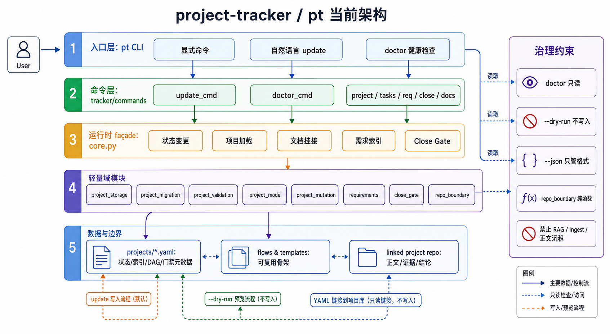
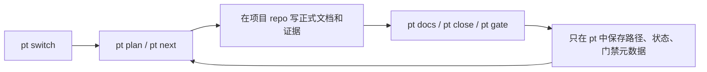

# Project Tracker (项目推进助手)

`project-tracker` 是一个轻量项目推进辅助工具。它帮助你用 `pt` 查看项目状态、下一步行动、任务依赖、文档挂接和简单闭环门禁；它不是项目正文归档仓、复杂项目管理平台或知识库系统。

正式需求、设计说明、BOM、测试记录、样品记录、发布结论和长期知识，应放在各自项目 repo、wiki 或专用知识库中。`project-tracker` 只保存紧凑状态、索引、路径和门禁元数据。

路线约束见 [Issue #1](https://github.com/joyhpc/project-tracker/issues/1)：当前阶段保持轻量辅助，暂缓深度项目管理化。



## 核心能力

- 项目 YAML 状态索引：阶段、任务、依赖、负责人、状态和日志
- DAG + CPM：计算关键路径、slack、可并行任务和下一步行动
- 文档路径挂接：把任务指向 linked project repo 中的正式文件
- 决策 / PoC / review 简要索引：只记录标题、状态、路径和少量摘要
- 简单门禁：提醒证据、样品、版本、正式回写路径是否缺失
- 导出与可视化：终端项目地图、Mermaid 依赖图、Gantt、CSV

以下能力如果仍存在于代码中，应视为待核验或实验能力，不应继续扩张：深度 prompt 生成、内置知识检索、复杂自动同步、跨仓自动 ingest、Web/通知集成。

## 安装

```bash
git clone git@github.com:joyhpc/project-tracker.git
cd project-tracker
python -m venv .venv
. .venv/bin/activate
pip install -e .
```

Windows 上可直接使用：

```powershell
python -m tracker --help
```

## 快速开始

```bash
# 创建和切换项目
pt init PILLOW --name "智能助眠枕头" --flow generic --repo ../smart-sleep-pillow
pt switch PILLOW

# 轻量推进
pt status
pt plan
pt next
pt tasks

# 任务状态
pt start fw_design
pt done fw_design --note "固件架构文档已回写项目仓"
pt block bringup --reason "等待样机"

# 文档挂接：正式文档写在项目 repo，本仓只保存路径
pt docs --link ../smart-sleep-pillow
pt docs fw_design

# 决策 / PoC / 门禁索引
pt decision --add "Gen1 只做 1-50Hz 振动"
pt poc --summary
pt close list --invalid-only

# 可视化与导出
pt map
pt deps
pt gantt
pt export nodes
```

## 文件边界

```text
project-tracker/
  projects/*.yaml        轻量项目状态、路径索引、DAG、门禁元数据
  flows/                 通用流程模板
  tracker/               pt CLI 与实现
  docs/                  工具自身协议和方法边界
  outputs/               本地临时输出，默认不提交

linked-project-repo/
  docs/                  正式需求、设计、验证、结论
  hardware/              原理图、PCB、BOM 等项目资料
  firmware/              固件代码
  test/                  原始测试记录、报告、样品证据
  .pt/                   可选的项目状态快照
```

原则：

- `project-tracker` 不吞并项目正文。
- `projects/*.yaml` 中的 `docs` / `evidence` 路径应指向 linked project repo 中的文件。
- 生成报告和回写页应优先写到 linked project repo；根目录不得沉积 AI 元分析、任务追踪或自动生成文件。

## 常用工作流



## 项目结构

```text
project-tracker/
├── pt                         # CLI 入口
├── tracker/
│   ├── cli.py                 # 命令路由
│   ├── core.py                # 项目状态 façade
│   ├── engine.py              # DAG + CPM 引擎
│   ├── close_gate.py          # Merge-to-Close 检查
│   ├── project_model.py       # 项目数据辅助函数
│   ├── project_validation.py  # YAML / DAG 校验
│   ├── project_mutation.py    # 状态变更规则
│   ├── project_query.py       # 状态聚合
│   ├── flow.py                # 流程定义加载
│   └── commands/              # CLI 命令实现
├── flows/                     # 流程模板
├── projects/                  # 项目状态 YAML
├── docs/                      # 工具协议、边界和方法说明
├── tests/                     # 回归测试
└── tools/                     # 辅助检查/迁移脚本
```

## 开发

```bash
python -m tracker doctor
python tools/check_repo_boundary.py
pytest -q
python -m tracker validate --all
```

## 生成物策略

仓库根目录禁止新增 AI 元分析或任务追踪文件，例如：

- `*_ANALYSIS.md`
- `*_ANALYSIS.txt`
- `*_ROADMAP.md`
- `*_INDEX.md`
- `TASK_*.md`
- `AGENT_TASKS.md`
- `*_AUTO.md`

历史 AI 自分析文档如果需要保留，应归档在 `docs/_archive/` 下，并且不得作为当前架构事实源。

## 文档

- `AGENTS.md` — 仓库边界和 Agent 工作规则
- `docs/PROJECT_DATA_LAYOUT.md` — 项目数据、样例、模板和生成物边界
- `docs/MERGE_TO_CLOSE_PROTOCOL.md` — Merge-to-Close 关闭门禁
- `docs/HARDWARE_CLOSURE_GATEKEEPER_PROTOCOL.md` — AI 硬件闭环审查官协议
- `docs/HARDWARE_CLOSURE_EVIDENCE_MATRIX.md` — Gate 触发与证据矩阵
- `docs/PROJECT_MAP_METHOD.md` — 项目地图方法与工具边界
- `docs/_archive/` — 历史 AI 自分析与过期路线文档，不作为当前事实源
